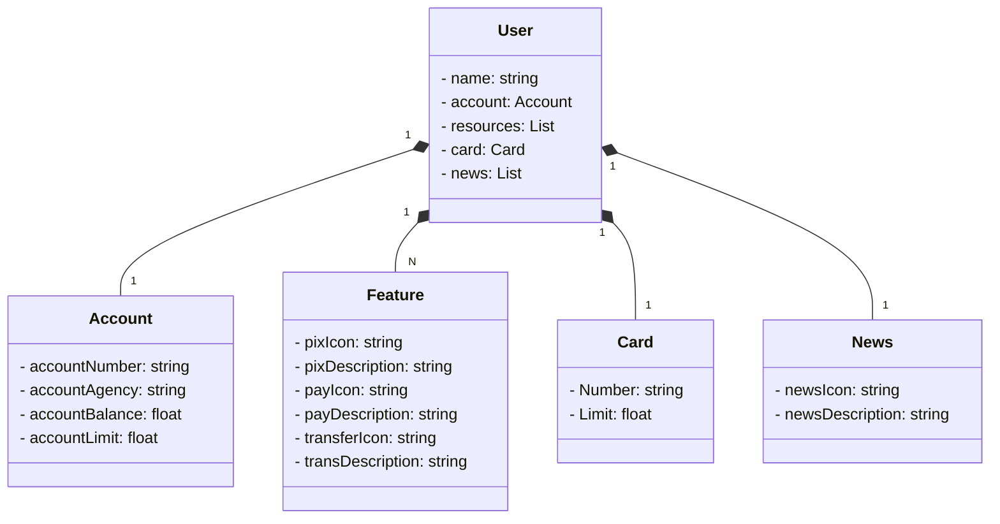

ture# Santander-dev-week-2023
desafio de código para o bootcamp Santander Becas na plataforma da DIO.me

##Diagrama de classes

```mermaid
classDiagram
class User {
  - name: string
  - account: Account
  - resources: List<Resource>
  - card: Card
  - news: List<News>
}

class Account {
  - accountNumber: string
  - accountAgency: string
  - accountBalance: float
  - accountLimit: float
}

class Feature {
  - pixIcon: string
  - pixDescription: string
  - payIcon: string
  - payDescription: string
  - transferIcon: string
  - transDescription: string
}

class Card {
  - Number: string
  - Limit: float
}

class News {
  - newsIcon: string
  - newsDescription: string
}

User "1" *-- "1" Account
User "1" *-- "N" Feature
User "1" *-- "1" Card
User "1" *-- "1" News
```
